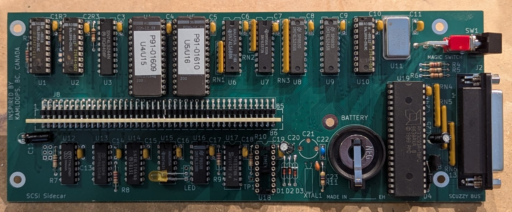
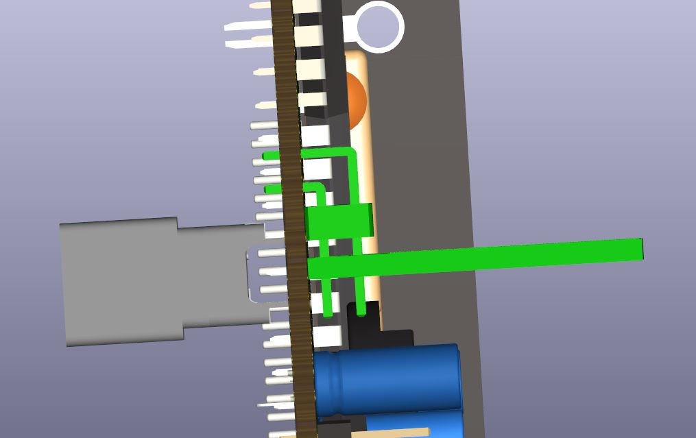
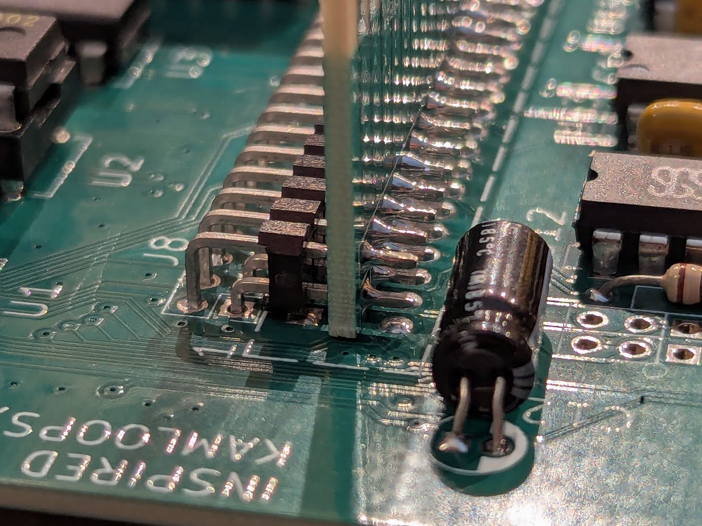

# Amiga SCSI Sidecar

**Alpha version: the PC board has not been fabricated or tested!**

Do you have an Amiga 1000 and want to connect it to a SCSI hard drive?
Well, wait no longer, because here is a solution. This project is a clone
of the Comspec SA-1000 product that was available in the 1980s, connecting
to the Amiga's sidecar bus port and providing a SCSI bus interface.

## Fabrication

The board is a simple 2-layer design, 222mm x 89mm (8.75in x 3.5in).

[Schematic](SCSISidecar.pdf)

[Bill of Materials](SCSISidecar.csv)

[Fab Package](fab/SCSISidecar_v1.zip)

Install 20-pin narrow DIP sockets at positions U1, U2, and U10 for the GALs
in case you need to modify them after the fact. Install 28-pin wide DIP sockets
at positions U4 and U5.

You may want to substitute a different rear-panel switch for the C&K part
to save a little money.

The 86-pin edge connector should be soldered to the back of the PCB (solder
side) since it plugs into the side of the Amiga 1000. You may need to find
an edge connector with extra long tails since the distance between the
bottom of the circuit board and the top of the edge connector should be
2.54cm (1") in order to correctly plug into the Amiga. This does depend
on your case design. If you mount the connector flush against the circuit
board (the TE 1-5530843-0 part number) then the board will sit right up 
against the plastic side of the Amiga case with no clearance for component
leads. If you want more clearance and don't mind spending extra money, try 
the EDAC 345-086-540-201.

Jumper J6 (near the SCSI connector) should be set to the "A" position.

### Optional expansion edge

If you want to stack another sidecar adapter, you'll need to add another
circuit board and a 0.1" right angle header.

This extra circuit board is a 2-layer design, 111.3mm x 25.4mm (4.38" x 1").

[Fab Package](SideCardEdge/fab/SideCardEdge_v1.zip)

After you fabricate it, take a right angle header (43 pins long so you
might need to stack a few end-to-end) and tack solder it at each end using
the *long* side of the pin header (the ends that usually plug into a female
header). Now take this board assembly and test fit it to the component side
of the main SCSI Sidecar board. The board should be perfectly lined up
with the slot on the edge connector on the solder side of the board.

You may need to trim the tails on the 84-pin edge connector already mounted
on the solder side of the SCSI Sidecar board. They should be flush to the
component side of the board so they don't interfere with the right angle
header.

If it's not aligned, you may have to adjust your tack soldered connections
to shift the card edge board up or down. Once it's all aligned, solder
the remaining connections, and then solder the assembly to the main
SCSI Sidecar board. The card edge board will sit flush with the main board.

## PAL programming

There are three source files located in the `pal` directory.

* scsi\_u1.pld
* scsi\_u2.pld
* scsi\_u10.pld

You can assemble these into JEDEC files using [galette](https://github.com/simon-frankau/galette),
or you can use the `jed` files already in that directory.

There are a number of tools that can program the PALs/GALs. I used the TL-866
with the [minipro](https://gitlab.com/DavidGriffith/minipro) tool under
Linux. The speed grade should be 25ns or faster. Please note that I have not
tested this with all variations of PALs or GALs, but I've used GAL16V8A devices
from National Semiconductor.

## EPROM programming

The boot PROMs are 27C128 devices, which you can also program using the TL-866. Use 200ns or faster devices.

## Testing and using

Plug into the sidecar connector, set the switch on the back to the HD position,
and switch on the Amiga. You should see the screen cycle through a variety of
colors as it looks for attached SCSI disks.

The external SCSI drive should be set to ID0.

I've had trouble getting even the original board to boot the kickstart image
from the external hard drive, so I've been using the
[Kickstart Eliminator](https://github.com/schlae/kickstart-eliminator).

Please note that you need to be using Kickstart 1.3 otherwise the machine
will just get stuck in a boot loop.

You'll probably want to read the [manual](https://bitsavers.org/pdf/comspec/SA_Series_Professional_SCSI_Host_Adaptor_Preliminary_V0_9F.pdf), which will show you how to use the [utilities disk](disk/comspec_utilities.adf) to set up a new hard drive.

## Troubleshooting

I've run into partially functional GALs, so consider trying a couple of
different devices. You might also put the GAL on a breadboard and spot check
it against a couple of the logic equations just in case.

The boot ROMs will blink the screen red if they detect an error:

| Flashes | Error |
|---------|-------|
| 2 | Couldn't select boot drive, is it turned on? |
| 3 | Timed out waiting for drive to go ready. |
| 4 | Could not read the "Unit Info File" which should be generated by SetUpHD. |
| 5 | Could not read Kickstart image. Use SetUpHD to install one on the hard disk. |
| 6 | SCSI bus stuck in reset. Is a SCSI drive powered off? |
| 7 | Kickstart ROMs installed, so autoboot will not work. |
| 8 | Mode sense command failed: maybe your drive doesn't support it. |

## Functional description

### SCSI controller

The SCSI controller is a fairly standard WD33C93 (plain or the A suffix).
Note that some versions may work better than others since there are multiple
versions of the embedded firmware.

DRQ (Data Request) status of the SCSI controller is monitored by the Amiga
by reading a status register. It can also be configured to trigger an
interrupt (INT2 by default).

The IRQ line can be configured to trigger an interrupt (INT6).

### Real-time clock

The device is a M6264B from OKI. The STD.P pulse output is tied to a test
point, TP1, presumably to help trim the clock frequency using trimmer
capacitor C21.

The RTC is enabled and disabled from the configuration register, and it
is turned on by default after a system reset.

### Autoconfiguration

On powerup, the card appears at location 0xE80000, which is the standard
location for Autoconfig. This happens only when the CONFIG\_IN# input
is low -- the Amiga 1000 has this pin grounded by default, but if this card
were somewhere else in the chain, it would not appear at this address until
all the preceding cards were configured.

The Amiga typically reads the ID registers from 0xE80000, stored in the high
nybble of the high byte by the PAL U2. This identifies the manufacturer and
model of the card and allows the Amiga to configure its base address.

The base address is stored at 0xE80048. Writing here latches the upper byte
into U7 and sets the configuration complete flag, which enables the latch
and overrides the 0xE8 address set by passive resistor networks RN1/2.

If the Amiga wants to disable the card instead, it can write to the 0x4C
address which tells it to shut up, and the card will not respond until the
next hardware reset.

Once the card is configured, the device registers are mapped to xx8000-xxFFFF
and the ROM is mapped to xx0000-xx7FFF, where xx is the base address.

### Bootstrapping

The Amiga 1000 ships with 8K of ROM that doesn't understand Autoconfig.
typically you will have to put in a Kickstart disk to load the 256K "ROM"
into the special Kickstart memory located on the Amiga 1000's daughterboard.

The SCSI Sidecar solves this problem rather neatly. Turn the rear switch to
the "HD boot" position, and the ROM gets mapped to location 0xF00000-0xF07FFF
and the device registers get mapped to 0xF08000-0xF08FFF even if the card is
unconfigured. This allows the ROM to appear in the Amiga's "CART" ROM area,
which the 8K boot ROM checks and jumps to if it exists. This autoboot ROM
then loads the Kickstart image from a dedicated area on the attached drive.

### Memory map

| Address | Function |
|---------|----------|
| 0x0000-0x003F? (read) | Autoconfigure: bits 15-12 contain the card ID values and autoconfig data. |
| 0x0048 (write)    | Autoconfigure: a write on powerup sets the card base address. |
| 0x004C (write)   | Autoconfigure: a write on powerup disables this card. |

| Address | Function |
|---------|----------|
| 0x0000-0x7FFF (read) | ROM chips |
| 0x8080-0x809F (write) | Card configuration register. |
| 0x8080-0x809F (read) | SCSI DRQ# status (placed in bit 15) |
| 0x80A0-0x80BF (r/w) | RTC chip |
| 0x80C0-0x80DF (r/w) | SCSI chip |
| 0x80E0-0x80FF (write) | Asserts the SCSI DACK signal |

The card configuration register bits are assigned as follows. (They all
default to 0 on a hard reset).

| Bit | Function |
|-----|----------|
|  8  | RTC\_EN#: Active low RTC enable signal. |
|  9  | unused |
| 10  | unused |
| 11  | When set, allows the SCSI\_DRQ signal to trigger an interrupt. |
| 12  | When set, allows the SCSI\_IRQ signal to trigger an interrupt. |
| 13  | When set, turns on the front panel LED. |
| 14  | When set, takes the SCSI bus and controller chip out of reset. |

## License

This project is secured under the CERN Open Hardware Licence Version 2 - Permissive.
